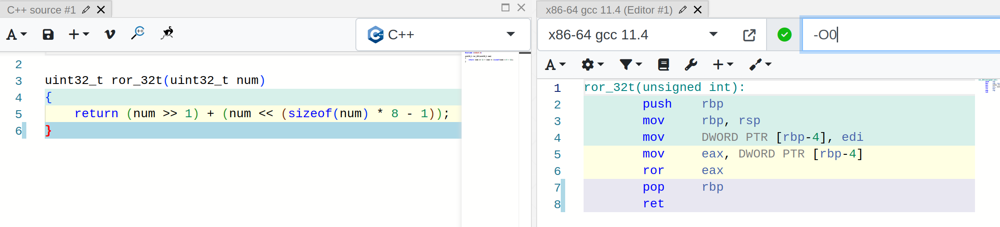
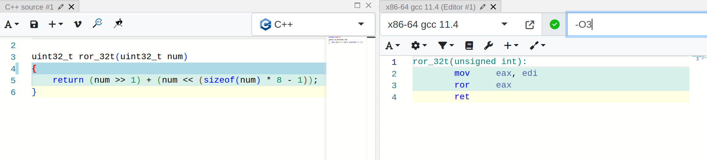
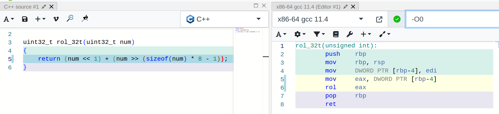
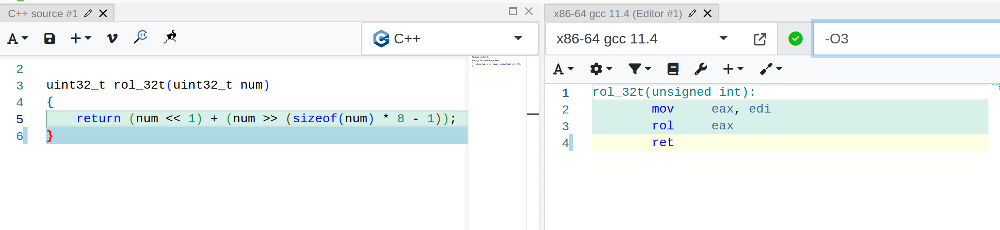

# Оптимизация хэш-таблицы

## О работе

В данной работе реализована хэш-таблица с разрешением коллизий методом цепочек. **Цель работы**: оптимизировать хэш-таблицу, то есть уменьшить время работы ее операций (поиска в ней). Для этого в работе производится сравнение различных хэш-функций с целью выбрать оптимальную. Кроме того, анализируется время работы операций таблицы и модифицируется исходный код тех из них, что затрачивают наибольшее время.

## О хэш-таблице с методом цепочек

Хэш-таблица -- это структура данных, хранящая пары ключ-значение (и то, и другое может быть любым типом данных) и позволяющая получать значение по своему ключу в среднем за O(1). Хэш-таблица похожа на  массив, но в массиве ключи строго фиксированы -- это числа от $0$ до $N-1$, где $N$ -- размер массива. В хэш-таблице ключи могут быть любыми, например, строковыми переменными. Именно такие ключи и используются в данной работе. Значениями в работе являются количества вхождения конкретного слова в заданный текст.

Хэш-таблицу можно хранить как массив. Но для этого необходимо отобразить ключи на множество $\{0, 1, \cdots, N-1\}$. Этим занимается хэш функция. Однако неизбежны коллизии, то есть совпадения значений хэш-функции для различающихся ключей.

Существуют разные способы разрешения коллизий, но в данной работе используется метод цепочек. Он заключается в следующем: для каждого значения хэш-функции в хэш-таблице есть связный список (неважно, односвязный или двусвязный). Узлы этого списка есть пары ключ-значение, для ключей которых значение хэш-функции соответствует данному списку. Тогда, если размеры всех списков небольшие и примерно одинаковые, хэш-таблица будет иметь в среднем константное время работы (без учета времени работы хэш-функции). Отсюда заключаем, что важно подобрать хэш-функцию, дающую распределение ключей по спискам, близкое к равномерному.

## Часть 1. Поиск оптимальной хэш-функции

### Методология

Для сравнения хэш функций в качестве исходных данных был взят текст, состоящий из ~64000 попарно различных английских слов. Выбранный размер хэш-таблицы 9973 (число простое, чтобы уменьшить вероятность коллизии при взятии значения функции по модулю размера). Тогда load factor примерно равен 6,4.
После загрузки исходных данных размеры списков, полученных при работе данной хэш-функции, записывались в файл. На их основе были построены гистограммы, представленные в работе ниже.
Также в работе представлена сравнительная таблица со среднеквадратичными отклонениями для рассмотренных хэш-функций.

Реализации тестируемых хэш-функций расположены в файле **hash_functions.h**.

### 1. Константная хэш-функция

Реализована функция `hashAlways1()`, которая всегда возвращает число $1$. Это очень плохая хэш-функция, так как она сводит адресацию в хэш-таблице к линейному поиску в связном списке.

.png)

### 2. Длина ключа

Функция `hashKeyLength()` возвращает длину слова-ключа. Хотя ее значение не является одинаковым для всех ключей, длина английских слов слабо варьируется, причем некоторые значения длин встречаются чаще других. Такая функция не дает равномерное распределение и имеет слишком узкий диапазон значений, следовательно, это плохая функция.

.png)


### 3. Первая буква ключа

Функция `hashFirstLetter()` возвращает первую букву ключа. Она лучше, чем константа и чем длина слова, но диапазон значений букв слова узок (26 или 52  в зависимости от того, различаем ли мы заглавные и строчные буквы). Поэтому такая функция довольно плохая. 

.png)

### 4. Контрольная сумма

Функция `hashChecksum()` вычисляет сумму ASCII кодов букв в ключе. При тестировании ее на хэш-таблицах размером порядка 500-600 может сложиться впечатление, что это хорошая хэш-функция. На гистограмме распределения есть пики и впадины, но в целом значения контрольной суммы охватывают весь диапазон номеров списков (так как берется остаток по модулю размера хэш-таблицы).

.png)

Но стоит помнить, что длина английских слов сильно ограничена,  поэтому ограничены будут и значения контрольной суммы. При рассмотрении данной функции на хэш-таблице большего размера можно заметить, что ее значения в основном не превосходят 2000, поэтому значительная часть списков не будет использоваться. Соответственно, это тоже плохая хэш-функция.

.png)

### 5. Битовое вращение вправо с исключающим "или"

Рассмотрим битовое представление числа. Каждый бит сдвинем вправо на одну позицию, а младший бит, для которого нет позиции справа, поместим на позицию старшего. Проведенную операцию назовем битовым вращением вправо (или циклическим битовым сдвигом вправо), а полученное число -- ее результатом.

В языке Си нет стандартной функции для этой операции, поэтому реализуем ее самостоятельно и сравним ассемблерные листинги написанной функции при использовании ключей оптимизации `-O0` и `-O3`. Стоит отметить, что существует ассемблерная инструкция `ror`, которая делает битовое вращение вправо. Проверим, сможет ли оптимизирующий компилятор правильно интерпретировать наши действия и заменить тело функции на инструкцию `ror`.

Как видно из ассемблерных листингов с сайта [godbolt.org](https://godbolt.org/), компилятор gcc смог определить, что мы делаем битовое вращение вправо, и вставил в тело функции инструкцию `ror` даже при флаге оптимизации `-O0`!



Однако при этом флаге ассемблерный код содержит много инструкций по работе с памятью. Посмотрим, что будет с флагом `-O3`.



Теперь функция выполняет только пересылку между регистрами и инструкцию `ror`.

Перейдем к заданию хэш-функции. Она вычисляется по рекуррентной формуле:
$hash(0) = 0, hash(i) = ror(hash(i-1)) \oplus key[i]$. Здесь символ $\oplus$ обозначает операцию *исключающее "или"*. Вычисления продолжаются, пока в ключе остаются неиспользованные буквы (пока $i$ не больше длины ключа). Получившийся код на Си:

```
int hashRorXor(const char *key)
{
    int hash = 0;

    while (*key != '\0')
    {
        hash = ror_32t(hash) ^ *key++;
    }

    return hash;
}
```

Ниже представлена гистограмма распределения по спискам. Видно, что функция имеет высокие пики, но она лучше всех представленных ранее, так как область ее значений охватывает всю ось OX.


### 6. Битовое вращение влево с исключающим "или".

Битовое вращение влево определяется аналогично вращению вправо. Результат анализа ассемблерных листингов функции, реализующей эту операцию, аналогичный. При флаге `-O0` компилятор также вставляет ассемблерную инструкцию `rol`, выполняющую эту операцию, а при флаге `-O3` функция состоит из двух  ассемблерных инструкций и `ret`.





Функция задается рекуррентно по формуле: $hash(0) = 0, hash(i) = rol(hash(i-1)) \oplus key[i]$, где символ $\oplus$ обозначает операцию *исключающее "или"*. Код на Си также аналогичный.

```
int hashRolXor(const char *key)
{
    int hash = 0;

    while (*key != '\0')
    {
        hash = rol_32t(hash) ^ *key++;
    }

    return hash;
}
```

Гистограмма распределения:


Анализ двух последних гистограмм распределения позволяет понять, что функция `hashRolXor()` дает распределение заметно ближе к равномерному, чем `hashRorXor()`. Максимальное количество слов в списке для `rol` меньше 25, в то время как для `ror` оно превышает 60.  Это может быть связано с тем, что `ror` изменяет старшие биты значения, которые отбрасываются при взятии остатка по модулю размера хэш-таблицы (ведь номер списка не превосходит этого размера). Так как размер таблицы не очень большой (в нашем случае, меньше $2^{16}$) и английские слова обычно короче 16 букв, эти старшие биты вообще не влияют на распределение по спискам. С другой стороны, `rol` меняет биты от младшего с старшему, поэтому `hashRolXor()` при небольших размерах таблицы работает лучше.

### 7. Полиномиальный хэш. GNU hash.

Полиномиальный хэш вычисляется по рекуррентной формуле:
$hash(0) = 0, hash(i) = (p \cdot hash(i-1)+ key[i]) \% m$, где $p$ и $m$ - числа. Для минимизации коллизий $p$ выбирается простым, $m$ может быть достаточно большим простым числом. В нашем случае в качестве $m$ мы возьмем размер хэш-таблицы.

GNU hash отличается от полиномиального хэша тем, что в качестве $p$ берутся числа Мерсенна, то есть простые числа, равные $2^n - 1$ при некотором $n$. Это нужно для ускорения вычислений: для умножения на такое число достаточно сделать битовый сдвиг и одно вычитание, что работает быстрее, чем умножение на произвольное число. Возьмем число $31 = 2^5 - 1$. Имеем следующий код на Си:

```
int hashGNU(const char *key)
{
    int hash = 0;

    while(*key != '\0')
    {
        hash = (hash << 5) - hash;
        hash = hash + *key++;
        hash = hash % HASH_MOD;
    }

    return hash;
}
```

Гистограмма распределения представлена ниже. Визуальный анализ показывает, что это хорошая хэш-функция.


### Среднеквадратичное отклонение

Имеем сравнительную таблицу со среднеквадратичными отклонениями. В ней функции отсортированы в порядке возрастания стандартного отклонения.

| Хэш-функция  | Стандартное отклонение |
|:------------:|:----------------------:|
| GNU hash     |   2.80                 |
| Rol Xor      |   4.68                 |
| Ror Xor      |   8.85                 |
| Checksum     |  26.72                 |
| First Letter | 158.00                 |
| Key Length   | 218.06                 |
| Const Hash   | 640.77                 |

Распределение, наиболее близкое к равномерному, было получено с помощью функции `hashGNU()`. Ее мы и будем использовать в дальнейшем при выполнении второй части работы.
