# Оптимизация хэш-таблицы

## О работе

В данной работе реализована хэш-таблица с разрешением коллизий методом цепочек. **Цель работы**: оптимизировать поиск в хэш-таблице. Для этого в работе производится сравнение различных хэш-функций с целью выбрать оптимальную. Кроме того, анализируется время работы операций таблицы и оптимизируется исходный код тех из них, что затрачивают наибольшее время.

## О хэш-таблице с методом цепочек

Хэш-таблица -- это структура данных, хранящая пары ключ-значение (и то, и другое может быть любым типом данных) и позволяющая получать значение по своему ключу в среднем за O(1). Хэш-таблица похожа на  массив, но в массиве ключи строго фиксированы -- это числа от $0$ до $N-1$, где $N$ -- размер массива. В хэш-таблице ключи могут быть любыми, например, строковыми переменными. Именно такие ключи и используются в данной работе. Значениями в работе являются количества вхождения конкретного слова в заданный текст.

Хэш-таблицу можно хранить как массив. Но для этого необходимо отобразить ключи на множество $\{0, 1, \cdots, N-1\}$. Этим занимается хэш функция. Однако неизбежны коллизии, то есть совпадения значений хэш-функции для различающихся ключей.

Существуют разные способы разрешения коллизий, но в данной работе используется метод цепочек. Он заключается в следующем: для каждого значения хэш-функции в хэш-таблице есть связный список (неважно, односвязный или двусвязный). Узлы этого списка есть пары ключ-значение, для ключей которых значение хэш-функции соответствует данному списку. Тогда, если размеры всех списков небольшие и примерно одинаковые, хэш-таблица будет иметь в среднем константное время работы (без учета времени работы хэш-функции). Отсюда заключаем, что важно подобрать хэш-функцию, дающую распределение ключей по спискам, близкое к равномерному.

Схематично хэш-таблицу с разрешением коллизий методом цепочек можно представить так:

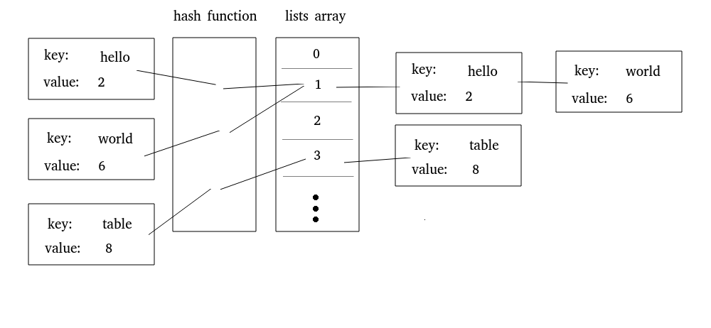

## Часть 1. Поиск оптимальной хэш-функции

### Методология

Для сравнения хэш функций в качестве исходных данных был взят текст, состоящий из ~64000 уникальных английских слов. Выбранный размер хэш-таблицы 9973 (число простое, чтобы уменьшить вероятность коллизии при взятии значения функции по модулю размера). Тогда load factor примерно равен 6,4.
После загрузки исходных данных размеры списков, полученных при работе данной хэш-функции, записывались в файл. На их основе были построены гистограммы, представленные в работе ниже.
Также в работе представлена сравнительная таблица со среднеквадратичными отклонениями для рассмотренных хэш-функций.

Реализации тестируемых хэш-функций расположены в файле **hash_functions.h**.

### 1. Константная хэш-функция

Реализована функция `hashAlways1()`, которая всегда возвращает число $1$. Это очень плохая хэш-функция, так как она сводит адресацию в хэш-таблице к линейному поиску в связном списке.

.png)

### 2. Длина ключа

Функция `hashKeyLength()` возвращает длину слова-ключа. Хотя ее значение не является одинаковым для всех ключей, длина английских слов слабо варьируется, причем некоторые значения длин встречаются чаще других. Такая функция не дает равномерное распределение и имеет слишком узкий диапазон значений, следовательно, это плохая функция.

.png)


### 3. Первая буква ключа

Функция `hashFirstLetter()` возвращает первую букву ключа. Она лучше, чем константа и чем длина слова, но диапазон значений букв слова узок (26 или 52  в зависимости от того, различаем ли мы заглавные и строчные буквы). Поэтому такая функция довольно плохая. 

.png)

### 4. Контрольная сумма

Функция `hashChecksum()` вычисляет сумму ASCII кодов букв в ключе. При тестировании ее на хэш-таблицах размером порядка 500-600 может сложиться впечатление, что это хорошая хэш-функция. На гистограмме распределения есть пики и впадины, но в целом значения контрольной суммы охватывают весь диапазон номеров списков (так как берется остаток по модулю размера хэш-таблицы).

.png)

Но стоит помнить, что длина английских слов сильно ограничена,  поэтому ограничены будут и значения контрольной суммы. При рассмотрении данной функции на хэш-таблице большего размера можно заметить, что ее значения в основном не превосходят 2000, поэтому значительная часть списков не будет использоваться. Соответственно, это тоже плохая хэш-функция.

.png)

### 5. Битовое вращение вправо с исключающим "или"

Рассмотрим битовое представление числа. Каждый бит сдвинем вправо на одну позицию, а младший бит, для которого нет позиции справа, поместим на позицию старшего. Проведенную операцию назовем битовым вращением вправо (или циклическим битовым сдвигом вправо), а полученное число -- ее результатом.

В языке Си нет стандартной функции для этой операции, поэтому реализуем ее самостоятельно и сравним ассемблерные листинги написанной функции при использовании ключей оптимизации `-O0` и `-O3`. Стоит отметить, что существует ассемблерная инструкция `ror`, которая делает битовое вращение вправо. Проверим, сможет ли оптимизирующий компилятор правильно интерпретировать наши действия и заменить тело функции на инструкцию `ror`.

Как видно из ассемблерных листингов с сайта [godbolt.org](https://godbolt.org/), компилятор gcc смог определить, что мы делаем битовое вращение вправо, и вставил в тело функции инструкцию `ror` даже при флаге оптимизации `-O0`!


Однако при этом флаге ассемблерный код содержит много инструкций по работе с памятью. Посмотрим, что будет с флагом `-O3`.


Теперь функция выполняет только пересылку между регистрами и инструкцию `ror`.

Перейдем к заданию хэш-функции. Она вычисляется по формуле:
$hash(0) = 0, hash(i) = ror(hash(i-1)) \oplus key[i]$. Здесь символ $\oplus$ обозначает операцию *исключающее "или"*. Вычисления продолжаются, пока в ключе остаются неиспользованные буквы (пока $i$ не больше длины ключа). Получившийся код на Си:

```
int hashRorXor(const char *key)
{
    int hash = 0;

    while (*key != '\0')
    {
        hash = ror_32t(hash) ^ *key++;
    }

    return hash;
}
```

Ниже представлена гистограмма распределения по спискам. Видно, что функция имеет высокие пики, но она лучше всех представленных ранее, так как область ее значений охватывает всю ось OX.


### 6. Битовое вращение влево с исключающим "или".

Битовое вращение влево определяется аналогично вращению вправо. Результат анализа ассемблерных листингов функции, реализующей эту операцию, аналогичный. При флаге `-O0` компилятор также вставляет ассемблерную инструкцию `rol`, выполняющую эту операцию, а при флаге `-O3` функция состоит из двух  ассемблерных инструкций и `ret`.


Функция задается по формуле: $hash(0) = 0, hash(i) = rol(hash(i-1)) \oplus key[i]$, где символ $\oplus$ обозначает операцию *исключающее "или"*. Код на Си также аналогичный.

```
int hashRolXor(const char *key)
{
    int hash = 0;

    while (*key != '\0')
    {
        hash = rol_32t(hash) ^ *key++;
    }

    return hash;
}
```

Гистограмма распределения:


Анализ двух последних гистограмм распределения позволяет понять, что функция `hashRolXor()` дает распределение заметно ближе к равномерному, чем `hashRorXor()`. Максимальное количество слов в списке для `rol` меньше 25, в то время как для `ror` оно превышает 60.  Это может быть связано с тем, что `ror` изменяет старшие биты значения, которые отбрасываются при взятии остатка по модулю размера хэш-таблицы (ведь номер списка не превосходит этого размера). Так как размер таблицы не очень большой (в нашем случае, меньше $2^{16}$) и английские слова обычно короче 16 букв, эти старшие биты вообще не влияют на распределение по спискам. С другой стороны, `rol` меняет биты от младшего с старшему, поэтому `hashRolXor()` при небольших размерах таблицы работает лучше.

### 7. Полиномиальный хэш. GNU hash.

Полиномиальный хэш вычисляется по формуле:
$hash(0) = 0, hash(i) = (p \cdot hash(i-1)+ key[i]) \% m$, где $p$ и $m$ - числа. Для минимизации коллизий $p$ выбирается простым, $m$ может быть достаточно большим простым числом. В нашем случае в качестве $m$ мы возьмем размер хэш-таблицы.

GNU hash отличается от полиномиального хэша тем, что в качестве $p$ берутся числа Мерсенна, то есть простые числа, равные $2^n - 1$ при некотором $n$. Это нужно для ускорения вычислений: для умножения на такое число достаточно сделать битовый сдвиг и одно вычитание, что работает быстрее, чем умножение на произвольное число. Возьмем число $31 = 2^5 - 1$. Имеем следующий код на Си:

```
int hashGNU(const char *key)
{
    int hash = 0;

    while(*key != '\0')
    {
        hash = (hash << 5) - hash;
        hash = hash + *key++;
        hash = hash % HASH_MOD;
    }

    return hash;
}
```

Гистограмма распределения представлена ниже. Визуальный анализ показывает, что это хорошая хэш-функция.


### Среднеквадратичное отклонение

Имеем сравнительную таблицу со среднеквадратичными отклонениями. В ней функции отсортированы в порядке возрастания стандартного отклонения.

| Хэш-функция  | Стандартное отклонение |
|:------------:|:----------------------:|
| GNU hash     |   2.80                 |
| Rol Xor      |   4.68                 |
| Ror Xor      |   8.85                 |
| Checksum     |  26.72                 |
| First Letter | 158.00                 |
| Key Length   | 218.06                 |
| Const Hash   | 640.77                 |

Распределение, наиболее близкое к равномерному, было получено с помощью функции `hashGNU()`. Ее мы и будем использовать в дальнейшем при выполнении второй части работы.

## Часть 2. Ускорение работы поиска в хэш-таблице

### Методология и инструменты

Теперь, когда хэш-функция выбрана, мы хотим сократить время выполнения операций хэш-таблицы, оптимизируя при этом исходный код. Будем использовать следующие оптимизации:

1. Intrinsic функции;
2. Встроенный ассемблер языка Си;
3. Написание функции на ассемблере в отдельном файле.

С такими оптимизациями надо быть аккуратнее, ведь они ухудшают читабельность кода и снижают переносимость. По поводу каждой такой оптимизации следует принимать решение, перевешивает ли ускорение работы возможную потерю переносимости, поддержки и понятности кода.

Оптимальность оптимизации будем определять следующим коэффициентом:
$K =  \frac{t / t_0} {AmountOfOptimizeLines} \cdot 1000$, где $t_0$ и $t$ -- время работы программы до и после оптимизации, $AmountOfOptimizeLines$ -- количество строк, содержащих ассемблерный код и/или intrinsic функции и работу с ними. Множитель $1000$ присутствует исключительно для наглядности. Чем данный коэффициент больше, тем лучше считается проведенная оптимизация.

Для измерения времени работы программы создадим хэш-таблицу с функцией `hashGNU()`, так как она имеет распределение, наиболее близкое к равномерному, среди рассмотренных ранее хэш-функций. Вставим в хэш-таблицу слова из того же файла, а сами слова из файла запомним в массив. После этого будем в цикле проходиться по массиву и каждое слово искать в хэш-таблице. Выполним 5000 циклов. Измерим время работы поиска в хэш-таблице без учета вставки слов в нее. Измерять будем в тиках процессора с помощью ассемблерной инструкции `rdtsc`. Нам не нужно переводить время из тиков в секунды, так как мы будем анализировать относительное ускорение.

Для каждой оптимизации будем строить таблицу, показывающую, во сколько раз ускорилась программа относительно первоначальной реализации и относительно прошлой оптимизации. Таблица будет выглядеть так:

|                    | Относительно изначальной версии| Относительно прошлой оптимизации|
|:------------------:|:------------------------------:|:-------------------------------:|
| Изначальная версия | $1.00$                         | $1.00$                          |
| Оптимизация 1      | $K_{1,1}$                      | $K_{1,1}$                       |
| Оптимизация 2      | $K_{2,1}$                      | $K_{2,2}$                       |
 
При этом первая оптимизация будет особенной, потому что до нее не было никаких других оптимизаций. Для нее в обоих столбцах будет стоять один и тот же коэффициент (что и отражено в таблице обозначениями). А для последующих оптимизаций коэффициенты будут различаться. 

Выполним три запуска программы с замерами и усредним значения. Характерное время работы программы 30 секунд.

| Запуск    | Время                 |
|:---------:|:----------------------|
| 1         | $79075277402$ |
| 2         | $79327961064$ |
| 3         | $79344644774$ |
|**Среднее**| $(7925 \pm 15) \cdot 10^7$ |

Для начала нужно определить узкие места в программе, чтобы понять, что именно нужно оптимизировать. Для этого воспользуемся программой **valgrind**, а именно еe утилитой-профилировщиком **callgrind**, который позволяет измерить время, затрачиваемое на выполнение каждой из функций, относительно всего времени работы программы. Выходной файл этой программы будем просматривать с помощью программы **kcachegrind**. 

При использовании профилировщика будем выполнять не 5000 циклов, а 1000, так как профилировщик значительно замедляет исполнение программы. Результат первого запуска профилировщика:

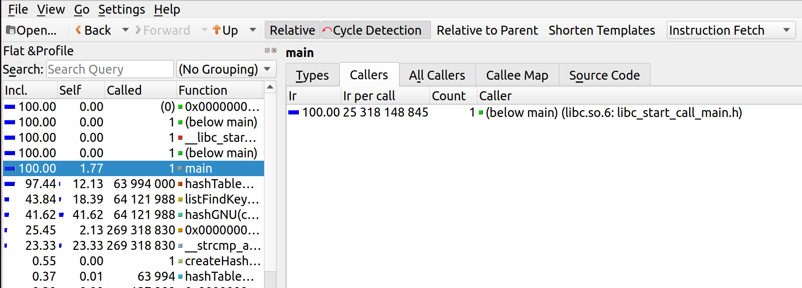

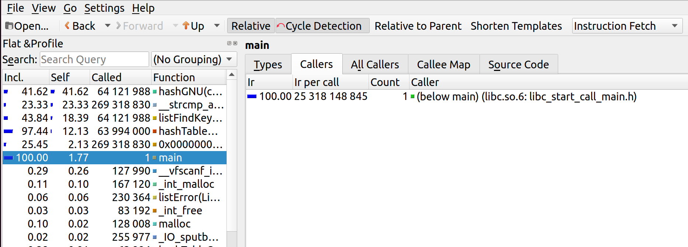

Здесь мы видим два разных ранжирования, потому что сallgrind вычисляет время работы как с учетом вызываемых функций, так и без их учета. Если мы оптимизируем некоторую функцию, то ускорятся и все функции, которые ее вызывают. Это нужно учитывать при выборе функцию, которую мы собираемся оптимизировать.

Посмотрим на самые затратные по времени функции:

    41.62% - hashGNU()
    23.33% - __strcmp_avx2()
    18.39% - listFindKey()
    12.13% - hashTableGet()

### 1. hashGNU() -- Хэш-функция

Начнем оптимизацию с самой затратной из функций -- `hashGNU()`. Посмотрим еще раз на ее код:

```
int hashGNU(const char *key)
{
    int hash = 0;

    while(*key != '\0')
    {
        hash = (hash << 5) - hash;
        hash = hash + *key++;
        hash = hash % HASH_MOD;
    }

    return hash;
}
```

Эта функция и так уже немного оптимизирована, ведь в ней нет операции умножения. Оно заменено на битовый сдвиг и вычитание. Но умножение -- не самая затратная операция в функции. Основная проблема заключается в остатке от деления. От него мы и будем стараться избавиться.

Стоит отметить, что полиномиальный хэш имеет серьезные ограничения в плане оптимизации, так как новое значение всегда вычисляется на основе старого, то есть мы имеем риск по данным. Эти вычисления нельзя выполнять параллельно, поэтому, вероятно, не удастся оптимизировать хэш-функцию значительно. 

Из-за того, что числа в компьютере представляются  в двоичном виде, можно легко брать остаток от деления на степени двойки путем логического умножения на битовую маску $2^n - 1$. Ближайшая степень двойки к числу $9973$ это $8192 = 2^{13}$. Тогда load factor нашей таблицы увеличится до $7,81$.

Такой подход имеет минусы, так как выбор размера хэш-таблицы резко сужается, что снижает универсальность. Мы попробуем провести такую оптимизацию, посмотрим, насколько ускорилась хэш-таблица, и примем решение, готовы ли мы пожертвовать универсальностью ради скорости.

Чтобы лучше понять, с чем мы имеем дело, надо посмотреть на ассемблерные листинги данной функции, полученные с помощью сайта [godbolt.org](https://godbolt.org/).

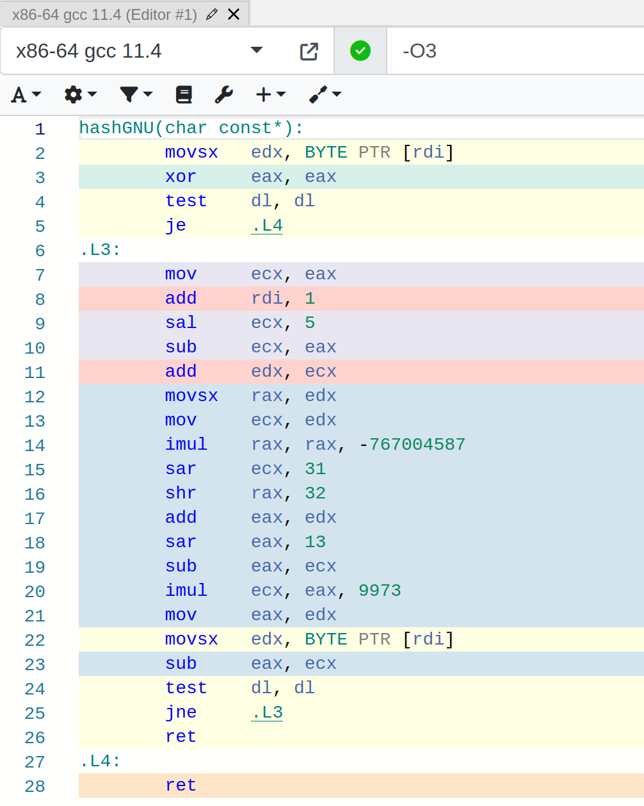

Ассемблерный код не содержит ожидаемой инструкции `div`, с помощью которой можно вычислить остаток от деления. Вместо этого компилятор создает последовательность сдвигов, сложений и умножений, вычисляющую остаток. Изменим размер хэш-таблицы на $8192 = 2^{13}$ и посмотрим, на что теперь заменит компилятор остаток от деления.

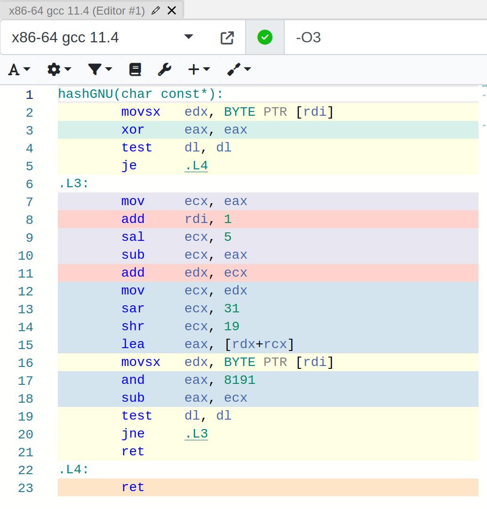

Видим, что помимо логического умножения на $8191$ компилятор проводит и другие лишние операции (здесь синий цвет фона -- отношение к операции остаток от деления). Вероятно, это связано с тем, что переменная hash объявлена в функции как int, поэтому компилятор при взятии остатка от деления должен учитывать знак числа. Попробуем изменить тип переменной в объявлении на unsigned.

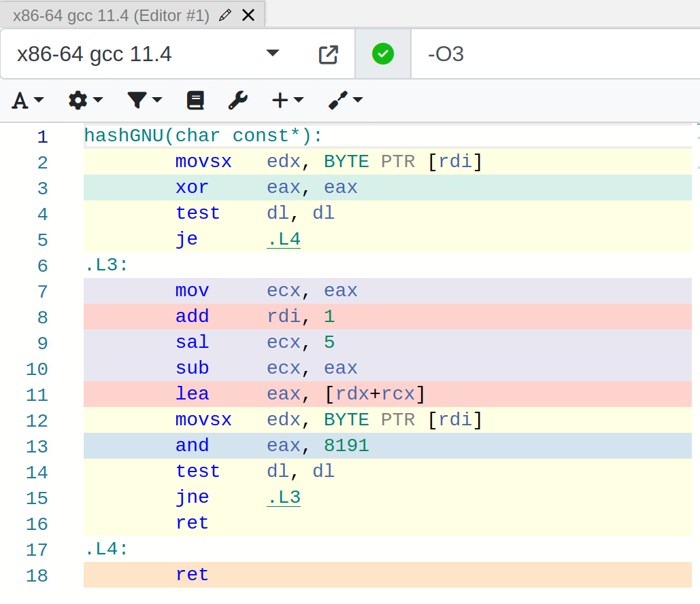

Заметим, что строковые переменные в Си оканчиваются символом '\0', который имеет ASCII код $0$. Поэтому, если на пустой строке выполнить тело цикла один раз, значение хэш-функции будет $0$, что и ожидается. Значит, цикл `while` можно заменить на `do {} while`, из за чего количество условных переходов при выполнении уменьшится на один и уменьшится размер функции. Итоговые код на Си и ассемблерный листинг:

```
int hashGNU(const char *key)
{
    unsigned hash = 0;

    do
    {
        hash = (hash << 5) - hash;
        hash = hash + *key;
        hash = hash % HASH_MOD;
    }   while (*key++ != '\0');

    return hash;
}
```

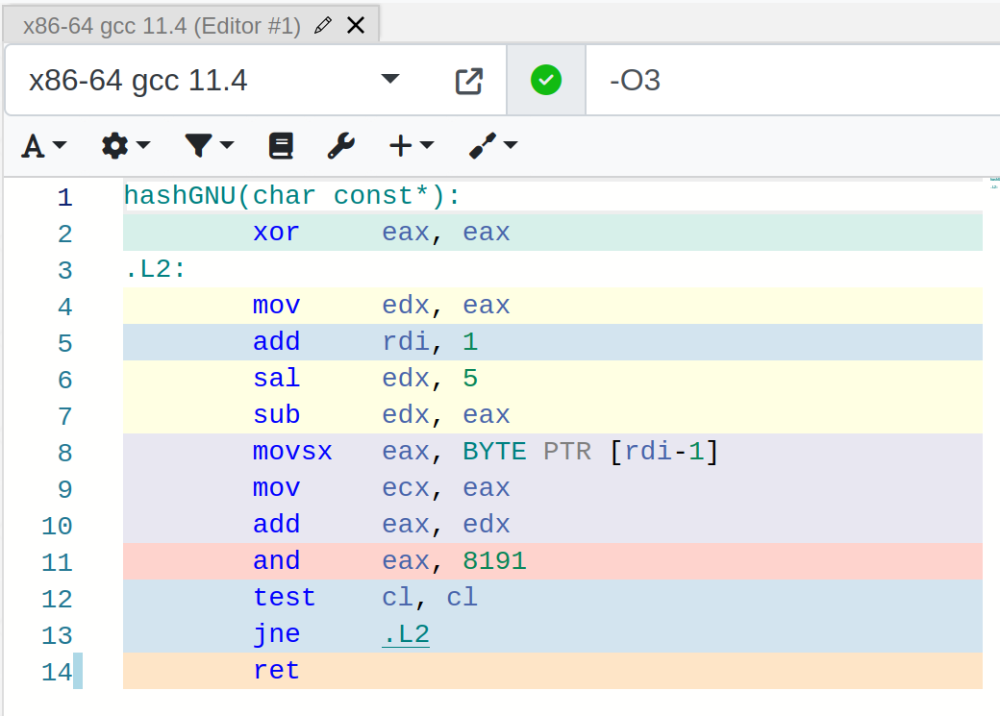

Теперь не очень понятно, как можно оптимизировать эту функцию с помощью ассемблера или intrinsic функций. Ассемблерный листинг фактически не содержит лишних действий, а проводить вычисления параллельно невозможно из-за зависимости нового значения от предыдущего.

Снова запустим профилировщик и проведем замеры с измененной хэш-функцией. Характерное время работы программы 25-27 секунд. Видно, что поиск в хэш-таблице действительно ускорился.

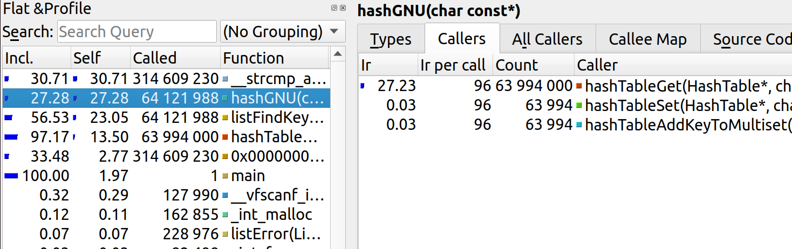

| Запуск    | hashGnu C only |
|:---------:|:---------------|
| 1         | $70082674222$  |
| 2         | $70027343116$  |
| 3         | $70288847156$  |
|**Среднее**| $(7013 \pm 14) \cdot 10^7$ |

Имеем ускорение программы примерно в $\frac{7.925}{7.013} = 1,13$ раз, или на 13%. Наша оптимизация не использует ассемблер или intrinsic функции, поэтому имеет "бесконечный" коэффициент. Оптимизация идеальна :).

|                    | Относительно изначальной версии| Относительно прошлой оптимизации|
|:------------------:|:------------------------------:|:-------------------------------:|
| Изначальная версия | $1.00$                         | $1.00$                          |
| hashGNU (C only)   | $1.13$                         | $1.13$                          |

К сожалению, вряд ли мы сможем ускорить эту хэш-функцию сильнее. Она не имеет аппаратной поддержки и всегда вычисляется последовательно. Но есть хэш-функция, имеющая аппаратную поддержку (в Си может использоваться как intrinsic функция). Это `crc32`. Ее преимущество в том, что она может вычисляться параллельно для разных байтов ключа.

Чтобы понять алгоритм работы этой хэш-функции, лучше обратиться к статье в [википедии](https://en.wikipedia.org/wiki/Cyclic_redundancy_check). Ее наивная реализация на Си:

```
int hashCRC32(const char *key)
{
    unsigned crc  = 0xFFFFFFFF;
    unsigned mask = 0;

    while (*key)
    {
        crc = crc ^ (unsigned)(*key++);

        for (int i = 7; i >= 0; i--)
        {
            mask = -(crc &  1);
            crc  =  (crc >> 1) ^ (0x04C11DB7 & mask);
        }
    }

    return crc;
}
```

Гистограмма распределения для этой хэш-функции:


Сравним стандартное отклонение распределений `hashCRC32()` и `hashGNU()` при размере таблицы $8192:$

| Хэш-функция  | Стандартное отклонение |
|:------------:|:----------------------:|
| GNU hash     |   2.80                 |
| CRC32        |   2.83                 |

Как видим, стандартное отклонение различается незначительно, функции распределяют слова по спискам примерно одинаково. Значит, можем заменить функцию `hashGNU()` на `hashCRC32()` и, вероятно, выиграть по производительности, при этом не потеряв равномерность распределения.

Напишем версию `hashCRC32()` с использованием intrinsic функции `_mm_crc32_u64`. Она вычисляет crc32 хэш для слова длиной 8 букв (если 1 буква кодируется одним байтом). Чтобы не пришлось вызывать эту функцию в цикле или тратить время на проверку и окончание слова, проанализируем длину английский слов. В моем наборе нет слов длиной более 32 символов, в английском языке такие слова очень редки. Поэтому можно считать, что все слова имеют длину 32 символа, а более короткие слова дополнять нулями. Для тех слов, которые все-таки длиннее, можно поддерживать отдельную хэш-таблицу (обращения к ней будут очень редкие, поэтому она не повлияет на время работы) или "обрезать" слова и учитывать только первые 32 символа. Мы будем обрезать слова в целях экономии времени, потраченного на работу. Но для решения реальной задачи подход с отдельной хэш-таблицей лучше, так как в наборе слов могут оказаться длинные слова, отличающиеся только окончанием, которое расположено на позиции больше 32. Такие слова при "обрезании" будут неразличимы.

Полученный код хэш-функции crc32 на intrinsic функциях:

```
int hashCRC32Intrinsics(const char *key)
{
    unsigned hash = 0;

    hash = _mm_crc32_u64(hash, *((const uint64_t*)key + 0));
    hash = _mm_crc32_u64(hash, *((const uint64_t*)key + 1));
    hash = _mm_crc32_u64(hash, *((const uint64_t*)key + 2));
    hash = _mm_crc32_u64(hash, *((const uint64_t*)key + 3));

    return hash;
}
```
Стоит отметить, что, если строки, поиск которых осуществляется в таблице, не дополнены нулями до 32 байт, то поиск всегда будет давать отрицательный результат, так как значение хэш-функции будет вычисляться неверно. Тогда либо хэш-таблица должна копировать строки в буфер длиной 32 байта, либо сами строки изначально должны быть дополнены до 32 байт нулями. При множественных обращениях второй вариант работает быстрее.

После запуска профилировщика видим, что хэш-функция значительно ускорилась. Теперь ее время работы незначительно по сравнению с временем работы поиска.

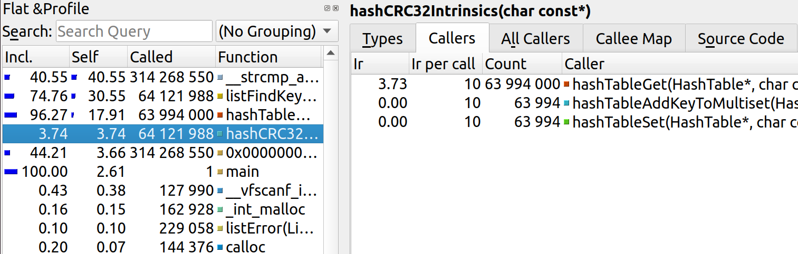

Измерим новое время работы программы. Характерное время работы 23 секунды.

| Запуск    | CRC32 Intrinsics |
|:---------:|:-----------------|
| 1         | $62883082354$    |
| 2         | $62780594700$    |
| 3         | $62911241650$    |
|**Среднее**| $(6286 \pm 7) \cdot 10^7$ |

Теперь посмотрим, как изменилось время работы программы относительно первоначальной реализации. Сравним результат оптимизации CRC32 c оптимизацией `hashGNU()` на Си. Будем считать их обе первой оптимизацией, потому что они взаимоисключающие. Поэтому разумно представить две таблицы.

|                    | Относительно изначальной версии| Относительно прошлой оптимизации|
|:------------------:|:------------------------------:|:-------------------------------:|
| Изначальная версия | $1.00$                         | $1.00$                          |
| hashGNU (C only)   | $1.13$                         | $1.13$                          |

|                    | Относительно изначальной версии| Относительно прошлой оптимизации|
|:------------------:|:------------------------------:|:-------------------------------:|
| Изначальная версия | $1.00$                         | $1.00$                          |
| crc32 Intrinsics   | $1.26$                         | $1.26$                          |

Видим, что аппаратно поддерживаемая `hashCRC32()` показала себя заметно лучше, чем даже оптимизированная версия `hashGNU()`.

### 2. strcmp()

Еще раз посмотрим на результат работы профилировщика после первой оптимизации.

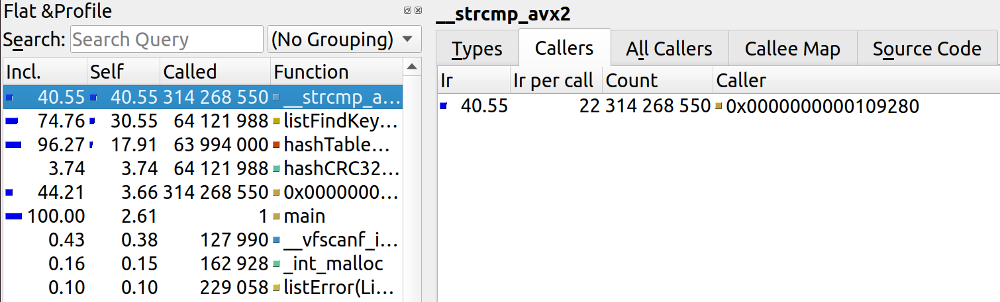

Теперь узким местом программы является функция `strcmp()`, проверяющая равенство ключей. Компилятор уже попытался оптимизировать ее с помощью intrinsic функций стандарта avx2. Мы попробуем сделать это еще лучше.

Мы считаем, что длина строки не превосходит 32 символов. С другой стороны, `YMM` регистры имеют размер 32 байта, что полностью вмещает в себя строку. Строки будем сравнивать с помощью инструкции `vptest`, которая позволяет быстро сравнить два `YMM` регистра на равенство. Если они равны, то после выполнения этой инструкции CF установится в 1. На основе этого напишем функцию `bool strEqualAsm()` через ассемблерную вставку. Она будет возвращать 1 (true), если строки равны, и 0 (false) в противном случае.

```
static inline bool stringsEqualAsm(const char *str1, const char *str2)
{
    bool equal = false;

    __asm__ 
    (
        ".intel_syntax noprefix\n\t"

        "vmovdqu ymm0, ymmword ptr [%1]\n\t" // read str1
        "vmovdqu ymm1, ymmword ptr [%2]\n\t" // read str2

        "vptest ymm0, ymm1\n\t"              // CF    = (str1 == str2)
        "setc %b0\n\t"                       // equal = (str1 == str2)

        "att_syntax prefix\n\t"

        : "+&r" (equal)
        : "r" (str1), "r" (str2)
        : "ymm0", "ymm1", "cc"
    );

    return equal;
}
```
Проведем измерения и построим сравнительную таблицу. Характерное время работы программы 17 секунд.

| Запуск    | strcmp inline asm |
|:---------:|:------------------|
| 1         | $45173909038$     |
| 2         | $45249289344$     |
| 3         | $45130959190$     |
|**Среднее**| $(4519 \pm 6) \cdot 10^7$ |

Сравнительная таблица:

|                    | Относительно изначальной версии | Относительно прошлой оптимизации |
|:------------------:|:-------------------------------:|:--------------------------------:|
| Изначальная версия | $1.00$                          | $1.00$                           |
| crc32 Intrinsics   | $1.26$                          | $1.26$                           |
| strcmp inline asm  | $1.75$                          | $1.39$                           |

### 3. listFindKey()

Теперь самой затратной функцией является `listFindKey()`.

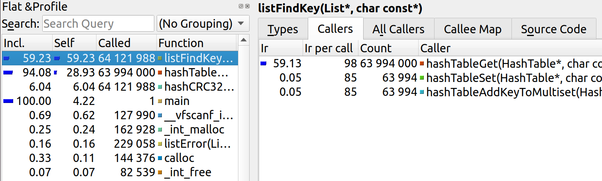

Так выглядит ее код на Си:

```
int listFindKey(List *list, const char *key)
{
    int current = list->nodes[0].next;

    while (current > 0)
    {
        if (stringsEqualAsm(list->nodes[current].data.str, key))
          { return current; }

        current = listNextIndex(list, current);
    }

    return 0;
}
```

Посмотрим на ассемблерный листинг этой функции, который возьмем с сайта [godbolt.org](https://godbolt.org/).

```
listFindKey(List*, char const*):
        mov     r9, QWORD PTR [rdi+16]  // r9  = &list->nodes
        mov     eax, DWORD PTR [r9+16]  // eax = list->nodes[0].next (int current)
        test    eax, eax
        jle     .L5                     // if (current <= 0) return 0;
        xor     r10d, r10d              // r10d = 0; (for setting edx to 0)
        jmp     .L3
.L8:
        cmp     DWORD PTR [rdi], eax    // cmp(list->size, current)
        jl      .L5                     // if (list->size < current) return 0;
        mov     eax, DWORD PTR [rcx+16] // current = list->nodes[current].next
        test    eax, eax              
        jle     .L5                     // if (current == 0) return 0;
.L3:
        movsx   rdx, eax                // rdx = current
        lea     rdx, [rdx+rdx*2]        // rdx = current * 3
        lea     rcx, [r9+rdx*8]         // rcx = &list->nodes + 24 * current 
                                        //       &list->nodes[current];
        mov     edx, r10d               // edx = 0;
        mov     r8, QWORD PTR [rcx]     // r8  = list->nodes[current].data.str;

    //  stringsEqualAsm inline
        .intel_syntax noprefix          
        vmovdqu ymm0, ymmword ptr [r8]  
        vmovdqu ymm1, ymmword ptr [rsi] 
        vptest  ymm0, ymm1
        setc    dl                      // dl = (list->nodes[current].data.str == key);

        test    dl, dl
        je      .L8                     // if(!stringsEqualAsm(...)) continue;
        ret                             // if( stringsEqualAsm(...)) return current;
.L5:
        xor     eax, eax
        ret
```

Возможные пути оптимизации:

1. В данном случае нам не нужно каждый раз сравнивать `current` с `list->size`, так как мы работаем с корректным списком. В нем для каждого элемента индекс следующего не превосходит размера списка, поэтому неравенство `current < list->size` выполнено всегда. 
2. На каждом шаге мы сравниваем `key` с некоторой строкой, причем `key` не меняется во время работы функции. Поэтому достаточно выгрузить `key` в `YMM` регистр один раз перед циклом.
3. Нет смысла устанавливать `dl` и делать `test dl, dl`, ведь можно использовать условный переход, связанный с CF.

Перепишем функцию `listFindKey()` на ассемблере в отдельном файле. За основу возьмем ассемблерный листинг, внесем в него описанные изменения. Будем компилировать отдельно и линковать. Полученный код:

```
listFindKeyAsm:
        mov     r9,  QWORD [rdi+16] ; r9  = &list->nodes
        mov     eax, DWORD [r9+16]  ; eax = list->nodes[0].next (int current)
        xor     r10d, r10d          ; r10d = 0; (for setting edx to 0)

        vmovdqu ymm1, YWORD [rsi]   ; key is copied to ymm1 (for cmp)

        test    eax, eax
        jle     NotFound            ; if (current <= 0) return 0
        jmp     StringsCmp

    NextNode:
        mov     eax, DWORD [rcx+16] ; current = list->nodes[current].next
        test    eax, eax
        jle     NotFound            ; if (current == 0) return 0;

    StringsCmp:
        movsx   rdx, eax            ; rdx = current
        lea     rdx, [rdx+rdx*2]    ; rdx = current * 3
        lea     rcx, [r9+rdx*8]     ; rcx = &list->nodes + 24 * current 
                                    ;       &list->nodes[current];
        mov     edx, r10d           ; edx = 0;
        mov     r8, QWORD [rcx]     ; r8  = list->nodes[current].data.str;

        vmovdqu ymm0, YWORD [r8]    ; list->nodes[current].data.str is copied to ymm0
        vptest  ymm0, ymm1          ; CF = (list->nodes[current].data.str == key);
        
        jnc     NextNode            ; if(!stringsEqualAsm(...)) continue;
        ret                         ; if( stringsEqualAsm(...)) return current;

    NotFound:
        xor     eax, eax
        ret
```

Проведем замеры времени. Характерное время работы программы 15 секунд.

| Запуск    | strcmp inline asm |
|:---------:|:------------------|
| 1         | $39205536676$     |
| 2         | $38964691074$     |
| 3         | $39109040774$     |
|**Среднее**| $(3909 \pm 12) \cdot 10^7$ |

Сравнительная таблица:

|                    | Относительно изначальной версии | Относительно прошлой оптимизации |
|:------------------:|:-------------------------------:|:--------------------------------:|
| Изначальная версия | $1.00$                          | $1.00$                           |
| strcmp inline asm  | $1.75$                          | $1.39$                           |
| ListFindKey nasm   | $2.03$                          | $1.16$                           |

Мы выполнили учебную задачу, а именно применили все три заявленных метода оптимизации. Последняя оптимизация еще дала ощутимый прирост в производительности, поэтому разумно продолжить оптимизировать. Но мы пока остановимся на третьей оптимизации.

### Сравнительный анализ оптимизаций

Выполнив все описанные оптимизации, мы ускорили программу в 2 раза.

Вспомним про коэффициент, введенный в начале второй части работы. Он показывает, насколько оптимальна данная оптимизация.

$K = \frac{t}{t_0} \cdot \frac{1000}{AmountOfOptimizeLines}$, где $t_0$ и $t$ -- время работы программы до и после оптимизации, $AmountOfOptimizeLines$ -- количество строк, содержащих ассемблерный код и/или intrinsic функции и работу с ними. В сводной таблице обозначим $AmountOfOptimizeLines$ как $N$.

|                    | Отн. изн. версии | Отн. прошл. опт. | N      | K        |
|:------------------:|:----------------:|:----------------:|:------:|:--------:|
| hashGNU (C only)   | $1.13$           | $1.13$           | $0$    | $\infty$ |
| crc32 Intrinsics   | $1.26$           | $1.26$           | $4$    | $315$    |
| strcmp inline asm  | $1.75$           | $1.39$           | $9$    | $154$    |
| ListFindKey nasm   | $2.03$           | $1.16$           | $25$   | $46$     |

Коэффициент примерно отражает баланс между ускорением, которое предоставляет данная оптимизация, и возможными ухудшениями читабельности, поддерживаемости кода, потерями переносимости из-за привязки к конкретной архитектуре. Из таблицы выше видно, что последняя оптимизация не является особенно выгодной, ведь в ней мы вынуждены были полностью переписать функцию на ассемблере, что ухудшило понимание кода и переносимость. Возможно, в некоторых ситуациях будет даже разумно отказаться от этой оптимизации. Но все же мы решили ее оставить, потому что прирост в производительности значительный.

## Выводы

В данной работе мы продемонстрировали пути оптимизации программы на примере хэш-таблицы. Мы убедились в том, что скорость поиска в хэш-таблице зависит от того, насколько равномерно хэш-функция распределяет ключи по спискам. Провели сравнение хэш-функций и подобрали  оптимальную.

Кроме того, мы исследовали различные способы оптимизации исходного кода функций, такие, как intrinsic функции, встроенный ассемблер и написание функций на ассемблере в отдельном файле. В итоге нам удалось ускорить поиск в хэш-таблице в 2 раза. Но в таких оптимизациях важно сохранять баланс между ускорением и переносимостью и читаемостью кода, ведь ассемблер и intrinsic функции могут значительно ухудшать понимание кода.   